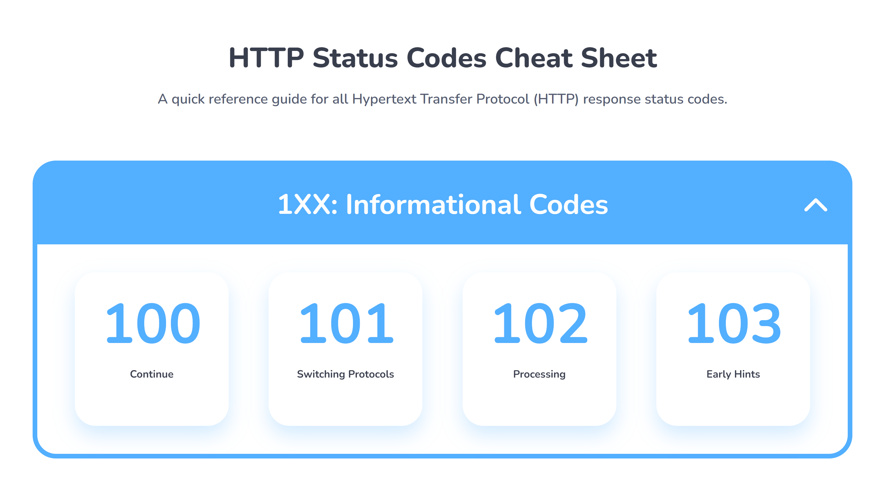

# HTTP Status Codes Cheat Sheet
A quick reference guide for all Hypertext Transfer Protocol (HTTP) response status codes.

🖥️Demo: https://diamonick.github.io/HTTP-Status-Codes-Cheat-Sheet/

# 📄How To Use
* Scroll through 63 response status codes categorized into 5 sections. Hover over a status code card to read its description.
* Click the dropdown arrow to quickly expand or collapse a section's content.

# 🛠️Software Used
* HTML
* CSS
* JavaScript
* Tailwind
* Figma
* Adobe Illustrator
